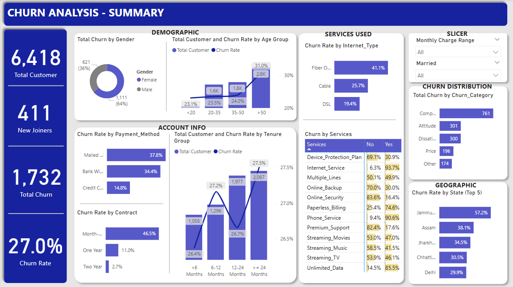

# Telecom Churn Prediction

This repository contains the complete implementation of a **Telecom Churn Prediction** project, which aims to predict whether a customer will churn based on their behavior and demographic data. The project includes exploratory data analysis (EDA), a Power BI dashboard for visualization, and a Flask application for making predictions using a machine learning model.

---

## Table of Contents
1. [Overview](#overview)
2. [Project Structure](#project-structure)
3. [Features](#features)
4. [Technologies Used](#technologies-used)
5. [Installation](#installation)
6. [Usage](#usage)
7. [Results](#results)
8. [Power BI Dashboard](#power-bi-dashboard)
9. [License](#license)
10. [Acknowledgments](#acknowledgments)

---

## Overview

Customer churn is a critical problem in the telecom industry. Predicting churn can help companies take proactive measures to retain customers. This project:
- Explores the dataset through comprehensive EDA.
- Visualizes insights using Power BI dashboards.
- Develops a predictive model to classify customers as "Churned" or "Stayed".
- Provides an easy-to-use Flask web application for real-time predictions.

---

## Project Structure

```
Telecom_Churn_Prediction/
│
├── data/                # Dataset and related files
├── notebooks/           # Jupyter notebooks for EDA and model development
├── dashboard/           # Power BI dashboard files
├── templates/           # HTML templates
├── app.py               # Flask application script
├── models/              # Saved machine learning models
├── requirements.txt     # Python dependencies
├── README.md            # Project documentation
├── LICENSE              # License information
└── dashboard.png        # Power BI dashboard screenshot
```

---

## Features

- **EDA**: Gained insights into customer demographics, usage patterns, and churn behavior.
- **Power BI Dashboard**: Interactive visualizations to explore data trends and relationships.
- **Machine Learning**: Trained and optimized a predictive model using the most relevant features.
- **Flask Application**: A web-based interface to allow users to input data and get churn predictions.

---

## Technologies Used

- **Python**: Core language for data processing and modeling.
- **Flask**: Backend framework for the web application.
- **Pandas & NumPy**: Data manipulation and analysis.
- **Matplotlib & Seaborn**: Data visualization for EDA.
- **Scikit-learn**: Machine learning modeling.
- **Power BI**: Visualization and dashboard creation.

---

## Installation

1. Clone the repository:
   ```bash
   git clone https://github.com/your_username/Telecom_Churn_Prediction.git
   cd Telecom_Churn_Prediction
   ```

2. Install required dependencies:
   ```bash
   pip install -r requirements.txt
   ```

3. Launch the Flask application:
   ```bash
   python app.py
   ```

4. Access the application at `http://127.0.0.1:5000/`.

---

## Usage

1. **Data Exploration**:
   - Use the Jupyter notebooks in the `notebooks/` directory to explore the dataset and understand key features.

2. **Power BI Dashboard**:
   - Open the Power BI dashboard file in the `dashboard/` directory to explore interactive visualizations.

3. **Web Application**:
   - Enter customer details into the Flask web app to get a churn prediction.

---

## Results

### Classification Report:
```
              precision    recall  f1-score   support

           0       0.82      0.89      0.85       614
           1       0.89      0.82      0.85       651

    accuracy                           0.85      1265
   macro avg       0.85      0.85      0.85      1265
weighted avg       0.85      0.85      0.85      1265
```

### Confusion Matrix:
```
[[546  68]
 [120 531]]
```

The model achieved an accuracy of **85%**, showing a balanced performance between identifying churned and non-churned customers. The optimization using **Gradient Boosting Classifier** improved the results.

---

## Power BI Dashboard

Below is a preview of the interactive dashboard created for analyzing customer churn:



---

## License

This project is licensed under the MIT License. See the [LICENSE](LICENSE) file for details.

---

## Acknowledgments

Special thanks to the dataset provider and the open-source community for tools and libraries.
